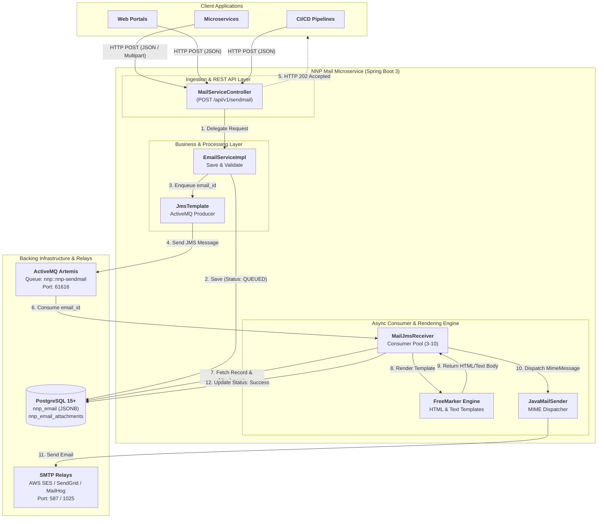

# PICC - PC - NNP Mail Service - Development Guidelines

Welcome to the **PICC - PC - NNP Mail Service** development guidelines. This document provides developers and open-source contributors with in-depth technical details on the architecture, setup instructions, development patterns, extension points, and code quality standards.

---

## Table of Contents

1. [Architecture & Design Principles](#1-architecture--design-principles)
2. [Project & Package Structure](#2-project--package-structure)
3. [Development Environment Setup](#3-development-environment-setup)
4. [Database Schema & JPA Entities](#4-database-schema--jpa-entities)
5. [Step-by-Step: Adding a New Email Template](#5-step-by-step-adding-a-new-email-template)
6. [Security & Sanitization Guidelines](#6-security--sanitization-guidelines)
7. [Code Quality, SAST & SBOM Tooling](#7-code-quality-sast--sbom-tooling)
8. [Testing & Verification Strategy](#8-testing--verification-strategy)
9. [Open-Source Contribution Guidelines](#9-open-source-contribution-guidelines)

---

## 1. Architecture & Design Principles

The NNP Mail Service is architected around **event-driven, asynchronous messaging** to isolate client applications from the latency and unreliability of remote SMTP networks.

### System Architecture Diagram



### Core Architecture Highlights

- **Decoupled Ingestion & Dispatch**: The REST controller acknowledges the client immediately with HTTP 202 (`QUEUED`) as soon as the email is persisted in the database and the ID is published to ActiveMQ Artemis.
- **Fail-Safe Processing**: If SMTP dispatch fails (e.g. rate-limiting, temporary network partition), the database record remains intact with status `QUEUED`, allowing the `/api/v1/resendmail/{id}` endpoint or a scheduled reconciliation worker to re-trigger delivery without re-uploading attachments.
- **Dynamic HTML/Text Templating**: Templating is handled via Apache FreeMarker, keeping presentation separated from Java code.

---

## 2. Project & Package Structure

```
nnp-mailservice/
├── .github/
│   ├── workflows/                      # GitHub Actions CI/CD workflows
│   └── ISSUE_TEMPLATE/                 # Issue reporting templates
├── .mvn/                               # Maven wrapper configuration
├── src/
│   ├── main/
│   │   ├── java/com/nubons/nnpmailservice/
│   │   │   ├── business/               # Asynchronous JMS message consumers (MailJmsReceiver)
│   │   │   ├── config/                 # Spring configurations (JMS, FreeMarker, DataSource)
│   │   │   ├── controller/             # REST API Controllers (MailServiceController)
│   │   │   ├── entity/                 # Hibernate/JPA entities (Email, EmailAttachment)
│   │   │   ├── exceptions/             # Global exception handlers and error response VO
│   │   │   ├── model/                  # DTOs / Value Objects (EmailVO, EmailAttachmentVO)
│   │   │   ├── repository/             # Spring Data JPA Repositories (EmailRepo, EmailAttachmentRepo)
│   │   │   ├── service/                # Service interface declarations (EmailService)
│   │   │   ├── serviceImpl/            # Business logic and mail construction (EmailServiceimpl)
│   │   │   ├── utils/                  # Utility helpers (LogUtils for log sanitization)
│   │   │   └── NnpMailserviceApplication.java # Spring Boot main entrypoint
│   │   └── resources/
│   │       ├── templates/              # FreeMarker templates (*.ftlh, *.ftl)
│   │       └── application.properties  # Base Spring properties
│   └── test/                           # Unit and Integration test suites
├── Dockerfile                          # Multi-stage container build
├── docker-compose.yml                  # Local development stack
├── spotbugs-exclude.xml                # SAST false-positive filters
├── pom.xml                             # Maven build and dependency management
├── README.md                           # Project overview
├── USER_MANUAL_AND_DEPLOYMENT_GUIDE.md # Operational & deployment manual
└── DEVELOPMENT_GUIDELINES.md           # Developer & contributor manual
```

---

## 3. Development Environment Setup

### Prerequisites

- **Java Development Kit (JDK) 17+** (Eclipse Temurin or OpenJDK recommended)
- **Maven 3.8+** (or use `./mvnw`)
- **IDE**: IntelliJ IDEA, VS Code, or Eclipse with **Lombok plugin** enabled
- **Docker** (for local backing services)

### Step 1: Start Backing Services

Use Docker Compose to start PostgreSQL, ActiveMQ Artemis, and MailHog:

```bash
docker-compose up -d postgres artemis mailhog
```

### Step 2: Configure IDE / Local Profile

Ensure your IDE uses JDK 17 and has annotation processing enabled for Project Lombok.

Set the active Spring profile to `standalone` using VM options:
```bash
-Dspring.profiles.active=standalone
```

Or copy `application.properties.example` to `application-standalone.properties`.

### Step 3: Run the Application

Execute using Maven:
```bash
./mvnw spring-boot:run -Dspring-boot.run.profiles=standalone
```

---

## 4. Database Schema & JPA Entities

The service uses Spring Data JPA with PostgreSQL. Schema definitions are automatically managed by Hibernate (`spring.jpa.hibernate.ddl-auto=update`), or can be created manually:

### PostgreSQL DDL Schema

```sql
-- Table: nnp_email
CREATE TABLE nnp_email (
    email_id BIGINT PRIMARY KEY,
    email_from VARCHAR(255) NOT NULL,
    from_name VARCHAR(255),
    email_to VARCHAR(1000) NOT NULL,
    to_name VARCHAR(255),
    email_cc VARCHAR(1000),
    email_cc_name VARCHAR(255),
    subject VARCHAR(500) NOT NULL,
    text TEXT,
    template_name VARCHAR(255),
    template_data_map JSONB,
    email_send_status VARCHAR(50),
    last_updated_date TIMESTAMP
);

-- Table: nnp_email_attachments
CREATE TABLE nnp_email_attachments (
    attachment_id BIGINT PRIMARY KEY,
    email_id BIGINT NOT NULL REFERENCES nnp_email(email_id) ON DELETE CASCADE,
    name VARCHAR(255),
    content_type VARCHAR(100),
    attachments BYTEA
);
```

### JPA Entity Notes

- `Email.java`:
  - `templateDataMap`: Serialized as a native PostgreSQL `jsonb` column using Hibernate's `@JdbcTypeCode(SqlTypes.JSON)`.
  - `emailAttachments`: One-to-Many cascade relationship mapped to `EmailAttachment`.
- `EmailAttachment.java`:
  - `attachments`: Stored as raw binary (`@Lob` / `byte[]`).

---

## 5. Step-by-Step: Adding a New Email Template

To introduce a new email template (e.g. `password_reset.ftlh`), follow these 3 steps:

### Step 1: Create the FreeMarker Template

Add `password_reset.ftlh` under `src/main/resources/templates/`:

```html
<!DOCTYPE html>
<html>
<head>
    <meta charset="UTF-8">
    <title>Password Reset Request</title>
</head>
<body style="font-family: Arial, sans-serif; color: #333333; line-height: 1.6;">
    <h2>Password Reset Request</h2>
    <p>Hello <strong>${name}</strong>,</p>
    <p>We received a request to reset your password. Click the link below to proceed:</p>
    <p>
        <a href="${resetUrl}" style="background-color: #0066cc; color: white; padding: 10px 20px; text-decoration: none; border-radius: 4px; display: inline-block;">
            Reset Password
        </a>
    </p>
    <p>If you did not request this, please ignore this email or contact support at ${supportEmail}.</p>
    <p>Regards,<br/>${signatureName}</p>
</body>
</html>
```

### Step 2: Register Template in `EmailServiceimpl.java`

Update the `EmailTemplate` enum and the switch expression in `src/main/java/com/nubons/nnpmailservice/serviceImpl/EmailServiceimpl.java`:

```java
private enum EmailTemplate {
    BILLING_INVOICE("billing_invoice.ftl"),
    REPLICATION("replication.ftlh"),
    WELCOME("welcome.ftlh"),
    WELCOME_NEW("welcomeNew.ftlh"),
    WELCOME_STR("welcomeStr.ftlh"),
    PASSWORD_RESET("password_reset.ftlh"); // <-- Add new template entry

    final String fileName;
    EmailTemplate(String fileName) { this.fileName = fileName; }

    static EmailTemplate fromName(String name) {
        for (EmailTemplate t : values()) {
            if (t.fileName.equals(name)) return t;
        }
        throw new IllegalArgumentException("Invalid email template: " + name);
    }
}
```

And in `getEmailContent()`:

```java
Template template = switch (resolved) {
    case BILLING_INVOICE -> configuration.getTemplate("billing_invoice.ftl");
    case REPLICATION     -> configuration.getTemplate("replication.ftlh");
    case WELCOME          -> configuration.getTemplate("welcome.ftlh");
    case WELCOME_NEW      -> configuration.getTemplate("welcomeNew.ftlh");
    case WELCOME_STR      -> configuration.getTemplate("welcomeStr.ftlh");
    case PASSWORD_RESET   -> configuration.getTemplate("password_reset.ftlh"); // <-- Map enum to template
};
```

### Step 3: Test and Verify

Trigger an email with your new template using curl:
```bash
curl -X POST "http://localhost:8080/api/v1/sendmail" \
  -H "Content-Type: application/json" \
  -d '{
    "from": "security@example.com",
    "to": "user@example.com",
    "subject": "Reset your password",
    "templateName": "password_reset.ftlh",
    "templateDataMap": {
      "name": "Jane Doe",
      "resetUrl": "https://example.com/reset?token=xyz123",
      "supportEmail": "support@example.com",
      "signatureName": "Security Team"
    }
  }'
```

---

## 6. Security & Sanitization Guidelines

### Log Injection Prevention (CRLF)

Never log raw user or exception input directly. Always pass user input and exception messages through `LogUtils.sanitizeForLog()` to prevent CRLF log injection:

```java
// Correct:
log.error("Error occurred: {}", LogUtils.sanitizeForLog(e.getLocalizedMessage()));

// Avoid:
log.error("Error occurred: " + e.getLocalizedMessage());
```

### Template Injection Protection

FreeMarker templates are strictly resolved from `classpath:templates/` via the hardcoded `EmailTemplate` enum. Arbitrary file path inclusion or user-supplied template code injection is forbidden.

---

## 7. Code Quality, SAST & SBOM Tooling

The Maven build is pre-configured with industry-standard static analysis and security tools:

### 1. Checkstyle
Validates code formatting against Google Java Style rules:
```bash
./mvnw checkstyle:check
```

### 2. SpotBugs + FindSecBugs (SAST)
Analyzes compiled bytecode for security bugs, null dereferences, and bad practices:
```bash
./mvnw spotbugs:check
```
*Custom exclusions are maintained in `spotbugs-exclude.xml`.*

### 3. OWASP Dependency-Check (SCA)
Scans all third-party dependencies for known CVE vulnerabilities:
```bash
./mvnw org.owasp:dependency-check-maven:check
```

### 4. CycloneDX SBOM
Generates a CycloneDX v1.5 Software Bill of Materials in JSON format during the package lifecycle:
```bash
./mvnw cyclonedx:makeAggregateBom
```
Output: `target/bom.json`

---

## 8. Testing & Verification Strategy

### Running the Test Suite
```bash
./mvnw clean test
```

### Writing Unit Tests for Services
Use Mockito to mock `JavaMailSender`, `EmailRepo`, and `JmsTemplate`:

```java
@ExtendWith(MockitoExtension.class)
class EmailServiceTest {

    @Mock
    private JavaMailSender emailSender;

    @Mock
    private EmailRepo emailRepo;

    @Mock
    private JmsTemplate jmsTemplate;

    @Mock
    private ObjectMapper objectMapper;

    @Mock
    private freemarker.template.Configuration configuration;

    @InjectMocks
    private EmailServiceimpl emailService;

    @Test
    void testSaveMailSuccess() throws Exception {
        EmailVO vo = new EmailVO();
        vo.setFrom("test@example.com");
        vo.setTo("dest@example.com");
        vo.setSubject("Test");
        vo.setText("Hello World");

        Email savedEntity = new Email();
        savedEntity.setEmailId(101L);
        savedEntity.setEmailSendStatus("QUEUED");

        when(emailRepo.saveAndFlush(any(Email.class))).thenReturn(savedEntity);

        EmailVO result = emailService.savemail(vo);

        assertNotNull(result);
        assertEquals(101L, result.getEmailId());
        assertEquals("QUEUED", result.getMailSendStatus());
        verify(jmsTemplate, times(1)).convertAndSend(eq(JmsConfig.REQUEST_QUEUE), eq(101L));
    }
}
```

---

## 9. Open-Source Contribution Guidelines

We welcome contributions from the community! Please follow these standards:

### Branching Strategy
- `main`: Production-ready branch.
- `develop`: Integration branch for new features.
- Feature branches: `feature/feature-name` or `fix/issue-name`.

### Commit Message Conventions
We follow [Conventional Commits](https://www.conventionalcommits.org/):
- `feat: add password reset template and enum handler`
- `fix: prevent null pointer exception on missing CC field`
- `docs: update deployment guidelines with Kubernetes manifests`
- `refactor: optimize HikariCP connection pool settings`

### Pull Request Checklist
Before submitting a PR:
- [ ] All code compiles without warnings (`./mvnw clean compile`).
- [ ] Unit and integration tests pass (`./mvnw test`).
- [ ] SpotBugs and Checkstyle checks pass (`./mvnw spotbugs:check checkstyle:check`).
- [ ] Relevant documentation in `README.md`, `USER_MANUAL_AND_DEPLOYMENT_GUIDE.md`, or `DEVELOPMENT_GUIDELINES.md` is updated.
- [ ] Sensitive tokens, passwords, and private endpoints are sanitized.

---

## Code of Conduct

Contributors are expected to adhere to standard respectful, inclusive, and professional open-source community guidelines as outlined in [CODE_OF_CONDUCT.md](CODE_OF_CONDUCT.md).
