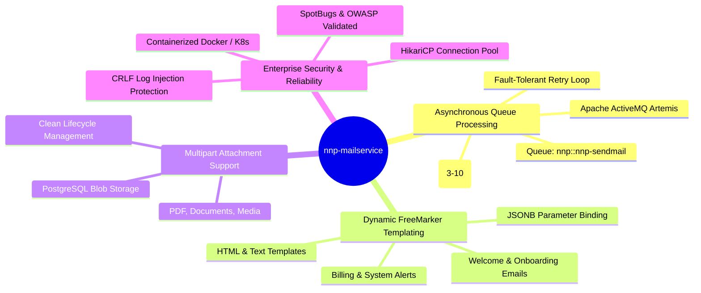
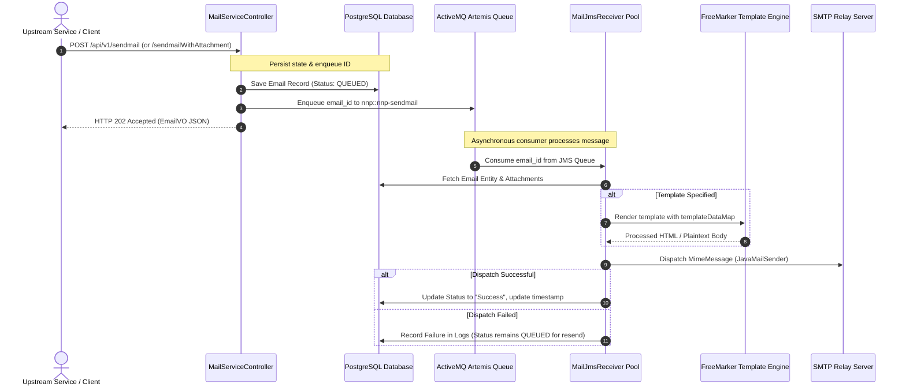

# PICC - PC - NNP Mail Service (`nnp-mailservice`)

[](LICENSE)
[](https://www.oracle.com/java/)
[](https://spring.io/projects/spring-boot)
[](#security-and-compliance)
[](#security-and-compliance)
[](#quick-start)
[](CONTRIBUTING.md)

**nnp-mailservice** is an enterprise-grade, asynchronous email dispatching microservice built for the **Nubo Native Platform (NNP)** within the **Platform Infrastructure and Core Components (PICC)** ecosystem.

It provides a non-blocking REST API for sending plaintext, multipart attachment, and dynamic FreeMarker templated emails, backed by PostgreSQL persistence and Apache ActiveMQ Artemis asynchronous message queuing.

---

## Documentation Index

| Document | Description |
| :--- | :--- |
| **[User Manual & Deployment Guide](USER_MANUAL_AND_DEPLOYMENT_GUIDE.md)** | End-user workflows, payload schemas, local Docker Compose setup, production Kubernetes manifests, and operational troubleshooting. |
| **[Development Guidelines](DEVELOPMENT_GUIDELINES.md)** | Architecture specifications, adding custom FreeMarker templates, Checkstyle rules, test strategy, and contribution workflow. |
| **[Contributing Guide](CONTRIBUTING.md)** | Contribution standards, pull request procedures, and governance. |
| **[Security Policy](SECURITY.md)** | Vulnerability reporting procedures and secret handling policies. |
| **[Maintainers](MAINTAINERS.md)** | Project maintainers and organizational stakeholders. |

---

## Core Capabilities



---

## Architecture & Message Flow



---

## Configuration Reference

All properties can be configured via `application.properties`, `application-standalone.properties`, or mapped to standard OS environment variables.

### Core & Server Properties

| Property Name | Environment Variable | Default Value | Description |
| :--- | :--- | :--- | :--- |
| `server.port` | `PORT` / `SERVER_PORT` | `8080` | Port on which the HTTP server listens |
| `spring.application.name` | `SPRING_APPLICATION_NAME` | `nnp-mailservice` | Application identifier |
| `spring.profiles.active` | `SPRING_PROFILES_ACTIVE` | `standalone` | Active Spring profile (`standalone`, `local`, `main`) |
| `spring.cloud.config.enabled` | `SPRING_CLOUD_CONFIG_ENABLED` | `false` | Enable or disable Spring Cloud Config server integration |

### Database Configuration (PostgreSQL)

| Property Name | Environment Variable | Default Value | Description |
| :--- | :--- | :--- | :--- |
| `spring.datasource.url` | `SPRING_DATASOURCE_URL` | `jdbc:postgresql://localhost:5432/nnp_mailservice` | JDBC connection string |
| `spring.datasource.username` | `SPRING_DATASOURCE_USERNAME` | `postgres` | Database username |
| `spring.datasource.password` | `SPRING_DATASOURCE_PASSWORD` | `postgres` | Database password |
| `spring.datasource.driverClassName` | `SPRING_DATASOURCE_DRIVERCLASSNAME` | `org.postgresql.Driver` | JDBC Driver class name |
| `spring.datasource.hikari.maximum-pool-size` | `SPRING_DATASOURCE_HIKARI_MAXIMUM_POOL_SIZE` | `10` | Maximum connection pool size |
| `spring.jpa.hibernate.ddl-auto` | `SPRING_JPA_HIBERNATE_DDL_AUTO` | `update` | Hibernate schema auto-generation mode |

### Messaging Configuration (ActiveMQ Artemis)

| Property Name | Environment Variable | Default Value | Description |
| :--- | :--- | :--- | :--- |
| `spring.activemq.broker-url` | `SPRING_ACTIVEMQ_BROKER_URL` | `tcp://localhost:61616` | ActiveMQ Artemis broker endpoint |
| `spring.activemq.user` | `SPRING_ACTIVEMQ_USER` | `artemis` | ActiveMQ Artemis username |
| `spring.activemq.password` | `SPRING_ACTIVEMQ_PASSWORD` | `artemis` | ActiveMQ Artemis password |

### Mail & SMTP Configuration

| Property Name | Environment Variable | Default Value | Description |
| :--- | :--- | :--- | :--- |
| `spring.mail.host` | `SPRING_MAIL_HOST` | `localhost` | SMTP relay hostname (e.g., `smtp.sendgrid.net`) |
| `spring.mail.port` | `SPRING_MAIL_PORT` | `1025` | SMTP port (`1025` for MailHog, `587` for TLS) |
| `spring.mail.username` | `SPRING_MAIL_USERNAME` | *(empty)* | SMTP authentication username |
| `spring.mail.password` | `SPRING_MAIL_PASSWORD` | *(empty)* | SMTP authentication password or API key |
| `spring.mail.properties.mail.smtp.auth` | `SPRING_MAIL_PROPERTIES_MAIL_SMTP_AUTH` | `false` | Enable SMTP authentication |
| `spring.mail.properties.mail.smtp.starttls.enable` | `SPRING_MAIL_PROPERTIES_MAIL_SMTP_STARTTLS_ENABLE` | `false` | Enable STARTTLS for secure connection |

---

## Quick Start

### 1. Local Setup with Docker Compose (Fastest)

To start the service along with PostgreSQL, ActiveMQ Artemis, and MailHog:

```bash
# Clone the repository
git clone https://github.com/your-org/nnp-mailservice.git
cd nnp-mailservice

# Start all backing services and the mail microservice
docker-compose up -d
```

Access the service endpoints:
- **Mail Service API**: [http://localhost:8080/swagger-ui.html](http://localhost:8080/swagger-ui.html)
- **MailHog Web UI (Inspect Emails)**: [http://localhost:8025](http://localhost:8025)
- **ActiveMQ Artemis Management Console**: [http://localhost:8161](http://localhost:8161) (User: `artemis`, Pass: `artemispassword`)

### 2. Run Directly with Maven Wrapper

Ensure PostgreSQL and ActiveMQ Artemis are running on localhost, then:

```bash
# Build the project
./mvnw clean package -DskipTests

# Run with standalone profile
java -jar target/nnp-mailservice-0.0.1-SNAPSHOT.jar --spring.profiles.active=standalone
```

---

## REST API Reference

All endpoints are prefixed with `/api/v1`.

### 1. Send Simple or Templated Email (`POST /api/v1/sendmail`)

**Request Body:**
```json
{
  "from": "no-reply@example.com",
  "fromName": "Support Team",
  "to": "user@example.com",
  "toName": "Alex Doe",
  "subject": "Welcome to the Platform!",
  "templateName": "welcome.ftlh",
  "templateDataMap": {
    "name": "Alex Doe",
    "userId": "alex.doe",
    "nnpName": "Cloud Platform",
    "nnpPortalURL": "https://portal.example.com",
    "nnpEmail": "support@example.com",
    "nnpAdmin": "Admin Team"
  }
}
```

**Response (HTTP 202 Accepted):**
```json
{
  "emailId": 1,
  "from": "no-reply@example.com",
  "fromName": "Support Team",
  "to": "user@example.com",
  "toName": "Alex Doe",
  "subject": "Welcome to the Platform!",
  "mailSendStatus": "QUEUED",
  "lastUpdatedDate": "2026-09-02 21:00:00"
}
```

### 2. Send Email with Attachment (`POST /api/v1/sendmailWithAttachment`)

Content-Type: `multipart/form-data`

| Parameter | Type | Description |
| :--- | :--- | :--- |
| `emailVoJson` | String (JSON) | Serialized `EmailVO` JSON payload |
| `document` | Multipart File | Binary file attachment (e.g. PDF, image) |

**Curl Example:**
```bash
curl -X POST "http://localhost:8080/api/v1/sendmailWithAttachment" \
  -F 'emailVoJson={"from":"billing@example.com","to":"client@example.com","subject":"Invoice #10042","text":"Please find attached invoice."}' \
  -F 'document=@/path/to/invoice.pdf;type=application/pdf'
```

### 3. Send Email with CC (`POST /api/v1/sendmailWithCc`)

```bash
curl -X POST "http://localhost:8080/api/v1/sendmailWithCc" \
  -H "Content-Type: application/json" \
  -d '{
    "from": "notifications@example.com",
    "to": "dev@example.com",
    "cc": "manager@example.com, audit@example.com",
    "subject": "Deployment Alert",
    "text": "Production deployment completed successfully."
  }'
```

### 4. Fetch Email Details (`GET /api/v1/maildetails/{mail_id}`)

```bash
curl -X GET "http://localhost:8080/api/v1/maildetails/1"
```

### 5. Resend Email (`GET /api/v1/resendmail/{mail_id}`)

```bash
curl -X GET "http://localhost:8080/api/v1/resendmail/1"
```

---

## Supported FreeMarker Templates

| Template File | Purpose | Required `templateDataMap` Keys |
| :--- | :--- | :--- |
| `welcome.ftlh` | HTML Welcome Email with CTA buttons | `name`, `userId`, `nnpName`, `nnpPortalURL`, `nnpEmail`, `nnpAdmin` |
| `welcomeNew.ftlh` | Modern HTML Welcome Notification | `name`, `userId`, `nnpName`, `nnpPortalURL`, `nnpEmail`, `nnpAdmin` |
| `welcomeStr.ftlh` | Plaintext Quick Welcome Email | `name`, `userId`, `nnpName`, `nnpPortalURL`, `nnpEmail`, `nnpAdmin` |
| `replication.ftlh` | Environment Component Replication Report | `name`, `environmentId`, `comp` (comma-separated list), `nnpEmail`, `nnpAdmin` |
| `billing_invoice.ftl` | Billing and Invoice Notification | `name`, `invoiceNumber`, `billingAmount`, `nnpEmail`, `nnpAdmin` |

---

## Security and Compliance

This repository enforces automated DevSecOps validation:
- **SAST**: SpotBugs with FindSecBugs
- **SCA**: OWASP Dependency-Check for known CVE vulnerabilities
- **SBOM**: CycloneDX specification 1.5 JSON output
- **Code Style**: Checkstyle compliance (`google_checks.xml`)

---

## License

This project is licensed under the [Apache License 2.0](LICENSE).
