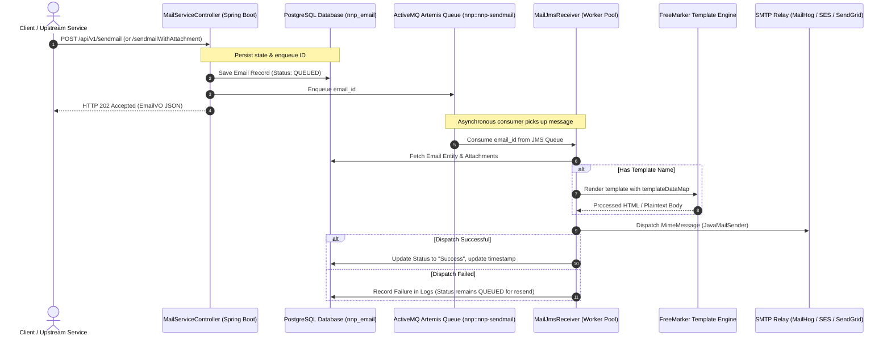

# PICC - PC - NNP Mail Service - User Manual & Deployment Guide

This document provides a comprehensive operational guide for system operators, integrating applications, and DevOps engineers using and deploying the **PICC - PC - NNP Mail Service**.

---

## Table of Contents

1. [System Overview](#1-system-overview)
2. [User & Integration Manual](#2-user--integration-manual)
   - [Email Dispatch Lifecycle](#email-dispatch-lifecycle)
   - [API Endpoints Reference](#api-endpoints-reference)
   - [FreeMarker Template Catalog & Data Maps](#freemarker-template-catalog--data-maps)
   - [Sending Attachments via Multipart Form](#sending-attachments-via-multipart-form)
   - [Handling Multiple Recipients & CC](#handling-multiple-recipients--cc)
   - [Tracking & Resending Emails](#tracking--resending-emails)
3. [Local Deployment Guideline](#3-local-deployment-guideline)
   - [Prerequisites](#prerequisites)
   - [Method 1: One-Click Docker Compose (Recommended)](#method-1-one-click-docker-compose-recommended)
   - [Method 2: Bare-Metal / Local CLI Setup](#method-2-bare-metal--local-cli-setup)
   - [Local Verification & Testing](#local-verification--testing)
4. [Production Deployment Guideline](#4-production-deployment-guideline)
   - [Architecture in Production](#architecture-in-production)
   - [Kubernetes Deployment (Manifests)](#kubernetes-deployment-manifests)
   - [Production SMTP Relay Integration](#production-smtp-relay-integration)
   - [Database Performance & Connection Pooling](#database-performance--connection-pooling)
   - [ActiveMQ Artemis High-Availability & Queues](#activemq-artemis-high-availability--queues)
   - [Observability & OpenTelemetry Tracing](#observability--opentelemetry-tracing)
5. [Troubleshooting & Diagnostics](#5-troubleshooting--diagnostics)

---

## 1. System Overview

The **NNP Mail Service** provides a resilient, asynchronous HTTP API for transactional and templated email transmission. Instead of synchronizing directly with slow third-party SMTP servers during the HTTP request, the service persists the message state in **PostgreSQL** and enqueues the email ID onto an **Apache ActiveMQ Artemis** queue (`nnp::nnp-sendmail`). Background consumers then render the email using **Apache FreeMarker** and dispatch it via **JavaMailSender**.

---

## 2. User & Integration Manual

### Email Dispatch Lifecycle



---

### API Endpoints Reference

Base URL: `http://<host>:<port>/api/v1`
Interactive Swagger UI: `http://<host>:<port>/swagger-ui.html`

#### Summary of Endpoints

| Method | Endpoint | Description | Content-Type |
| :--- | :--- | :--- | :--- |
| `POST` | `/sendmail` | Send plaintext or template email | `application/json` |
| `POST` | `/sendmailWithAttachment` | Send email with a file attachment | `multipart/form-data` |
| `POST` | `/sendmailWithCc` | Send email with CC recipients | `application/json` |
| `POST` | `/sendmailWithCcAndAttachment`| Send email with CC & file attachment | `multipart/form-data` |
| `GET` | `/maildetails/{mail_id}` | Fetch email status & details by ID | `application/json` |
| `GET` | `/resendmail/{mail_id}` | Trigger retry for a failed/pending email | N/A |

---

### FreeMarker Template Catalog & Data Maps

The service bundles 5 pre-configured templates under `src/main/resources/templates/`. When using templates, set `templateName` to the filename and populate `templateDataMap` with the required parameters.

#### 1. Standard Welcome Email (`welcome.ftlh`)
Rich HTML welcome email with call-to-action buttons.
```json
{
  "from": "support@example.com",
  "fromName": "Cloud Platform Admin",
  "to": "user@example.com",
  "toName": "John Doe",
  "subject": "Welcome to Cloud Platform",
  "templateName": "welcome.ftlh",
  "templateDataMap": {
    "name": "John Doe",
    "userId": "jdoe",
    "nnpName": "Enterprise Cloud",
    "nnpPortalURL": "https://portal.example.com",
    "nnpEmail": "support@example.com",
    "nnpAdmin": "Platform Support Team"
  }
}
```

#### 2. Modern Card Welcome Email (`welcomeNew.ftlh`)
Modern HTML layout with card styling and credentials box.
```json
{
  "from": "support@example.com",
  "to": "user@example.com",
  "subject": "Your New Account Credentials",
  "templateName": "welcomeNew.ftlh",
  "templateDataMap": {
    "name": "Jane Smith",
    "userId": "jsmith",
    "nnpName": "Enterprise Cloud",
    "nnpPortalURL": "https://portal.example.com",
    "nnpEmail": "support@example.com",
    "nnpAdmin": "Identity Team"
  }
}
```

#### 3. Plaintext Welcome Email (`welcomeStr.ftlh`)
Lightweight plain text email for low-bandwidth clients.
```json
{
  "from": "support@example.com",
  "to": "user@example.com",
  "subject": "Account Activated",
  "templateName": "welcomeStr.ftlh",
  "templateDataMap": {
    "name": "Jane Smith",
    "userId": "jsmith",
    "nnpName": "Enterprise Cloud",
    "nnpPortalURL": "https://portal.example.com",
    "nnpEmail": "support@example.com",
    "nnpAdmin": "Support Desk"
  }
}
```

#### 4. Environment Replication Notification (`replication.ftlh`)
Sends a notification listing deployed components.
```json
{
  "from": "devops@example.com",
  "to": "dev-team@example.com",
  "subject": "Environment Replication Completed",
  "templateName": "replication.ftlh",
  "templateDataMap": {
    "name": "Alex Dev",
    "environmentId": "ENV-PROD-US-EAST",
    "comp": "Auth-Service, Billing-Service, Mail-Service, Redis-Cache",
    "nnpEmail": "devops@example.com",
    "nnpAdmin": "DevOps Automation"
  }
}
```

#### 5. Billing & Invoice Template (`billing_invoice.ftl`)
Sends account invoice summaries.
```json
{
  "from": "billing@example.com",
  "to": "finance@example.com",
  "subject": "Monthly Subscription Invoice",
  "templateName": "billing_invoice.ftl",
  "templateDataMap": {
    "name": "Acme Corp",
    "invoiceNumber": "INV-2026-09-001",
    "billingAmount": "$1,450.00",
    "nnpEmail": "billing@example.com",
    "nnpAdmin": "Billing Operations"
  }
}
```

---

### Sending Attachments via Multipart Form

When attaching a document (such as a PDF invoice or log archive), use the multipart endpoints:

```bash
curl -X POST "http://localhost:8080/api/v1/sendmailWithAttachment" \
  -H "Accept: application/json" \
  -F 'emailVoJson={
    "from": "billing@example.com",
    "fromName": "Billing Dept",
    "to": "customer@example.com",
    "subject": "Your Monthly Invoice",
    "text": "Hello, please find your monthly invoice attached."
  }' \
  -F 'document=@/path/to/invoice.pdf;type=application/pdf'
```

---

### Handling Multiple Recipients & CC

Both the `to` and `cc` fields support multiple comma-separated email addresses:

```json
{
  "from": "alerts@example.com",
  "to": "lead1@example.com, lead2@example.com",
  "cc": "audit@example.com, manager@example.com",
  "subject": "Critical Security Alert",
  "text": "Security scanner identified an unpatched library in staging."
}
```

---

### Tracking & Resending Emails

#### 1. Querying Delivery Status
```bash
curl -X GET "http://localhost:8080/api/v1/maildetails/42"
```

Response includes the persisted `mailSendStatus` (`QUEUED`, `Success`, etc.) and `lastUpdatedDate`.

#### 2. Re-triggering Email Dispatch
If an email was stuck in `QUEUED` due to temporary SMTP relay unavailability:
```bash
curl -X GET "http://localhost:8080/api/v1/resendmail/42"
```
This pushes the `email_id` back onto the ActiveMQ Artemis queue for immediate redelivery.

---

## 3. Local Deployment Guideline

### Prerequisites

- **Java JDK 17** or higher
- **Maven 3.8+** (or use bundled `./mvnw`)
- **Docker & Docker Compose** (recommended for fastest setup)
- **PostgreSQL 13+** (if running without Docker)
- **Apache ActiveMQ Artemis 2.20+** (if running without Docker)

---

### Method 1: One-Click Docker Compose (Recommended)

1. Clone the repository:
   ```bash
   git clone https://github.com/Nubo-Native-Platform/PICC-PC-NNP-Mailservice.git
   cd PICC-PC-NNP-Mailservice
   ```

2. Start all components in background:
   ```bash
   docker-compose up -d
   ```

3. Verify container status:
   ```bash
   docker-compose ps
   ```

4. Service Ports:
   - **Mail Service API**: [http://localhost:8080](http://localhost:8080)
   - **MailHog (SMTP Web Inbox)**: [http://localhost:8025](http://localhost:8025)
   - **ActiveMQ Artemis Management**: [http://localhost:8161](http://localhost:8161) (`artemis` / `artemispassword`)
   - **PostgreSQL**: `localhost:5432` (`postgres` / `postgrespassword`)

5. View logs:
   ```bash
   docker-compose logs -f mailservice
   ```

6. Stop the stack:
   ```bash
   docker-compose down
   ```

---

### Method 2: Bare-Metal / Local CLI Setup

If you have native installations of PostgreSQL and ActiveMQ Artemis:

1. **Create PostgreSQL Database**:
   ```sql
   CREATE DATABASE nnp_mailservice;
   ```

2. **Start ActiveMQ Artemis**:
   Ensure broker is running on `tcp://localhost:61616`.

3. **Start Local Mock SMTP Server (e.g. MailHog or smtp4dev)**:
   Ensure SMTP server is listening on port `1025` (or configure your SMTP server host/port).

4. **Configure Environment Variables**:
   Copy `.env.example` to `.env` or set environment variables:
   ```bash
   export SPRING_PROFILES_ACTIVE=standalone
   export SPRING_CLOUD_CONFIG_ENABLED=false
   export SPRING_DATASOURCE_URL=jdbc:postgresql://localhost:5432/nnp_mailservice
   export SPRING_DATASOURCE_USERNAME=postgres
   export SPRING_DATASOURCE_PASSWORD=your_password
   export SPRING_ACTIVEMQ_BROKER_URL=tcp://localhost:61616
   export SPRING_ACTIVEMQ_USER=artemis
   export SPRING_ACTIVEMQ_PASSWORD=your_artemis_password
   export SPRING_MAIL_HOST=localhost
   export SPRING_MAIL_PORT=1025
   ```

5. **Build and Run**:
   ```bash
   ./mvnw clean package -DskipTests
   java -jar target/nnp-mailservice-0.0.1-SNAPSHOT.jar
   ```

---

### Local Verification & Testing

Send a test email using curl:
```bash
curl -X POST "http://localhost:8080/api/v1/sendmail" \
  -H "Content-Type: application/json" \
  -d '{
    "from": "test@example.com",
    "to": "recipient@example.com",
    "subject": "Local Test Email",
    "text": "Hello from NNP Mail Service running locally!"
  }'
```

If using Docker Compose, navigate to `http://localhost:8025` (MailHog) to see the received email formatted with headers and content.

---

## 4. Production Deployment Guideline

### Architecture in Production

In production environments, `nnp-mailservice` runs as stateless containers behind an Ingress controller / API Gateway, backed by a managed PostgreSQL cluster (e.g., AWS RDS, Cloud SQL) and high-availability ActiveMQ Artemis brokers.

---

### Kubernetes Deployment (Manifests)

#### 1. ConfigMap & Secret (`mailservice-config.yaml`)

```yaml
apiVersion: v1
kind: ConfigMap
metadata:
  name: nnp-mailservice-config
  namespace: nnp-services
data:
  SPRING_PROFILES_ACTIVE: "standalone"
  SPRING_CLOUD_CONFIG_ENABLED: "false"
  SPRING_DATASOURCE_URL: "jdbc:postgresql://postgres-ha.nnp-services.svc.cluster.local:5432/nnp_mailservice"
  SPRING_DATASOURCE_DRIVERCLASSNAME: "org.postgresql.Driver"
  SPRING_ACTIVEMQ_BROKER_URL: "tcp://artemis-broker.nnp-services.svc.cluster.local:61616"
  SPRING_MAIL_HOST: "email-smtp.us-east-1.amazonaws.com"
  SPRING_MAIL_PORT: "587"
  SPRING_MAIL_PROPERTIES_MAIL_SMTP_AUTH: "true"
  SPRING_MAIL_PROPERTIES_MAIL_SMTP_STARTTLS_ENABLE: "true"
---
apiVersion: v1
kind: Secret
metadata:
  name: nnp-mailservice-secrets
  namespace: nnp-services
type: Opaque
stringData:
  SPRING_DATASOURCE_USERNAME: "db_user"
  SPRING_DATASOURCE_PASSWORD: "db_strong_password"
  SPRING_ACTIVEMQ_USER: "artemis_user"
  SPRING_ACTIVEMQ_PASSWORD: "artemis_strong_password"
  SPRING_MAIL_USERNAME: "SES_SMTP_USERNAME"
  SPRING_MAIL_PASSWORD: "SES_SMTP_PASSWORD"
```

#### 2. Kubernetes Deployment & Service (`mailservice-deployment.yaml`)

```yaml
apiVersion: apps/v1
kind: Deployment
metadata:
  name: nnp-mailservice
  namespace: nnp-services
  labels:
    app: nnp-mailservice
spec:
  replicas: 3
  selector:
    matchLabels:
      app: nnp-mailservice
  template:
    metadata:
      labels:
        app: nnp-mailservice
    spec:
      containers:
        - name: mailservice
          image: your-registry.example.com/nnp/nnp-mailservice:1.0.0
          imagePullPolicy: IfNotPresent
          ports:
            - containerPort: 8080
          envFrom:
            - configMapRef:
                name: nnp-mailservice-config
            - secretRef:
                name: nnp-mailservice-secrets
          resources:
            requests:
              memory: "512Mi"
              cpu: "250m"
            limits:
              memory: "1024Mi"
              cpu: "1000m"
          livenessProbe:
            httpGet:
              path: /actuator/health/liveness
              port: 8080
            initialDelaySeconds: 30
            periodSeconds: 10
          readinessProbe:
            httpGet:
              path: /actuator/health/readiness
              port: 8080
            initialDelaySeconds: 20
            periodSeconds: 5
---
apiVersion: v1
kind: Service
metadata:
  name: nnp-mailservice
  namespace: nnp-services
spec:
  type: ClusterIP
  ports:
    - port: 8080
      targetPort: 8080
  selector:
    app: nnp-mailservice
```

---

### Production SMTP Relay Integration

#### AWS SES Configuration
```properties
spring.mail.host=email-smtp.us-east-1.amazonaws.com
spring.mail.port=587
spring.mail.username=YOUR_SES_SMTP_USERNAME
spring.mail.password=YOUR_SES_SMTP_PASSWORD
spring.mail.properties.mail.smtp.auth=true
spring.mail.properties.mail.smtp.starttls.enable=true
spring.mail.properties.mail.smtp.starttls.required=true
```

#### SendGrid Configuration
```properties
spring.mail.host=smtp.sendgrid.net
spring.mail.port=587
spring.mail.username=apikey
spring.mail.password=YOUR_SENDGRID_API_KEY
spring.mail.properties.mail.smtp.auth=true
spring.mail.properties.mail.smtp.starttls.enable=true
```

---

### Database Performance & Connection Pooling

In high-concurrency production workloads, configure the **HikariCP** connection pool in `application.properties`:

```properties
spring.datasource.hikari.maximum-pool-size=20
spring.datasource.hikari.minimum-idle=5
spring.datasource.hikari.idle-timeout=30000
spring.datasource.hikari.max-lifetime=1800000
spring.datasource.hikari.connection-timeout=20000
spring.datasource.hikari.pool-name=NNPMailServiceHikariPool
```

Ensure the PostgreSQL instance has sufficient `max_connections` allocated.

---

### ActiveMQ Artemis High-Availability & Queues

The JMS receiver is configured with automatic concurrency:
- **Default Concurrency**: `3-10` concurrent consumers (`factory.setConcurrency("3-10")` in `JmsConfig.java`).
- **Destination Queue**: `nnp::nnp-sendmail`
- Ensure dead-letter addresses (DLA) and expiry queues are configured in the broker's `broker.xml` to prevent message loss on persistent failure.

---

### Observability & OpenTelemetry Tracing

The Docker image supports the OpenTelemetry Java Agent for distributed tracing. Pass `-javaagent:opentelemetry-javaagent.jar` and configure:
```bash
export OTEL_SERVICE_NAME=nnp-mailservice
export OTEL_EXPORTER_OTLP_ENDPOINT=http://otel-collector.observability:4317
export OTEL_TRACES_EXPORTER=otlp
```

---

## 5. Troubleshooting & Diagnostics

| Symptom / Error | Root Cause | Resolution |
| :--- | :--- | :--- |
| `HTTP 400: Bad Request. Mail Text or template name should present` | Neither `text` nor `templateName` was provided in payload. | Provide a valid message text or a valid template name from the catalog. |
| `HTTP 400: Bad Request. CC email address(es) should be present` | CC endpoint invoked without `cc` field. | Ensure `cc` field contains valid comma-separated email addresses. |
| `HTTP 404: Email with id : X Not Found` | Requested email ID does not exist in `nnp_email` table. | Verify ID using database or check original `emailId` from POST response. |
| `HTTP 500: Error while parsing template data map` | `templateDataMap` contains malformed JSON or non-string values. | Ensure `templateDataMap` is a valid key-value dictionary of strings. |
| `MessagingException: Could not connect to SMTP host` | Network partition, blocked port 587/25, or incorrect SMTP host/port. | Verify connectivity using `nc -zv <host> <port>` and check firewall/egress rules. |
| `AuthenticationFailedException` | Invalid SMTP credentials / expired API key. | Verify credentials in secrets manager and test using an external mail client. |
| `JmsException: Failed to connect to broker` | ActiveMQ Artemis is down or unreachable at configured broker URL. | Check Artemis pod/service health, verify credentials and `tcp://` port 61616. |
